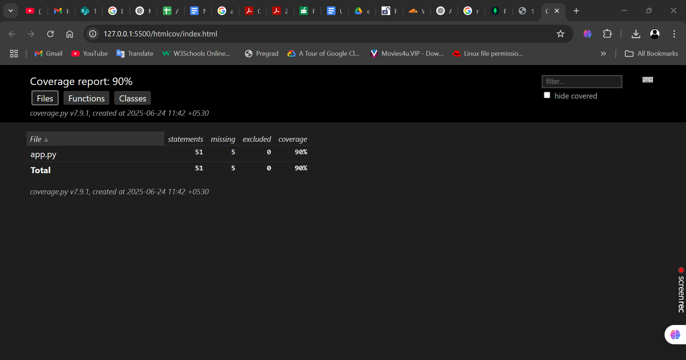

# ✅ Task Manager API with Full Test Suite (Flask + MongoDB)

This is a simple **REST API** for managing tasks using **Flask** and **MongoDB**. It supports full **CRUD operations** and includes complete **unit**, **integration**, and **API endpoint tests** with **test coverage reporting**.

---

## 🚀 API Endpoints

| Method | Endpoint        | Description             |
|--------|------------------|-------------------------|
| GET    | `/tasks`         | Get all tasks           |
| POST   | `/tasks`         | Create a new task       |
| PUT    | `/tasks/<id>`    | Update an existing task |
| DELETE | `/tasks/<id>`    | Delete a task           |

> Full endpoint details available in [`API_DOC.md`](./API_DOC.md)

---

## 🧰 Tech Stack

- **Backend**: Flask + MongoDB
- **Database**: MongoDB Atlas (or local MongoDB)
- **Testing**: Pytest, pytest-cov, mongomock

---

## 🛠 How to Run the App

### 1. Install dependencies:
```bash
pip install -r requirements.txt
```

### 2. Set your MongoDB URI (optional for testing):
```bash
# Windows
set MONGO_URI=mongodb://localhost:27017/taskmanager

# Linux/macOS
export MONGO_URI=mongodb://localhost:27017/taskmanager
```

### 3. Start the Flask server:
```bash
python app.py
```

---

## 🧪 How to Run Tests

### Install testing tools:
```bash
pip install pytest pytest-cov mongomock
```

### Run all tests with coverage:
```bash
pytest --cov=app --cov-report=html
```

- Unit Tests → Logic
- Integration Tests → MongoDB mock
- API Tests → Flask route testing with test client

---

## ✅ Test Results

- ✔ `test_unit.py` – 2 tests
- ✔ `test_integration.py` – 2 tests
- ✔ `test_api.py` – 3 tests
- ✅ **All 7 tests passed**

---

## 📊 Test Coverage Screenshot




> Generated from `htmlcov/index.html` after test run.

---

## 📦 Project Structure

```
task-manager-api-with-frontend/
├── app.py
├── requirements.txt
├── tests/
│   ├── test_unit.py
│   ├── test_integration.py
│   └── test_api.py
├── htmlcov/
│   └── coverage-screenshot.png
├── API_DOC.md
├── README.md
```

---

## 📤 GitHub Submission Instructions

```bash
git init
git add .
git commit -m "Added tests and coverage for Flask API"
git branch -M main
git remote add origin https://github.com/YOUR_USERNAME/YOUR_REPO.git
git push -u origin main
```

---

## 👨‍💻 Author

**Abhilash Dalai**